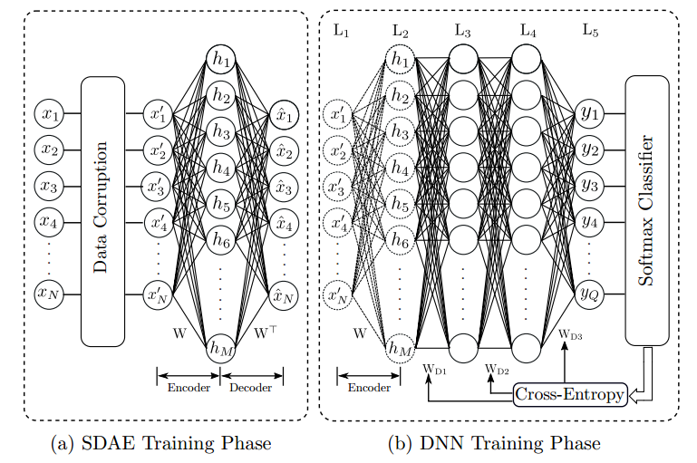

# DeepDOA
Finding Direction of arrival (DOA) of small UAVs using Sparse Denoising Autoencoders and Deep Neural Networks. An implementation of a Sparse Denoising Autoencoder (SDAE)-based Deep Neural Network (DNN) for the direction finding (DF) of small unmanned aerial vehicles (UAVs). It is motivated by the practical challenges associated with classical DF algorithms such as MUSIC and ESPRIT. 

Whole Architecture:

Training:

A detailed description can be found in our paper : https://github.com/LahiruJayasinghe/publications/blob/master/RF-based%20direction%20finding%20of%20UAVs%20using%20DNN.pdf 
