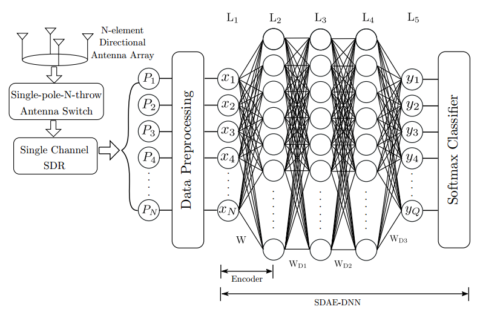

# DeepDOA
An implementation of a Sparse Denoising Autoencoder (SDAE)-based Deep Neural Network (DNN) for direction finding (DF) of small unmanned aerial vehicles (UAVs). It is motivated by the practical challenges associated with classical DF algorithms such as MUSIC and ESPRIT. 

The proposed DF scheme is practical and low-complex in the sense that a phase synchronization mechanism, an antenna calibration mechanism, and the analytical model of the antenna radiation pattern are not essential. Also, the proposed DF method can be implemented using a single-channel RF receiver.

For more details, please see our paper below.

### Whole Architecture:



### Architecture training phase:


### Dependencies

- Tensorflow (recommended below 1.5)
- Numpy 1.14.4

### Dataset

A partial dataset is provided to demonstrate our method
training data : Dround_Data_New/Normalized
testing data : Dround_Data_New/Normalized_test

data are categorized according to 45 degree sectors in training/testing data 
eg : 'deg_0_normalize.csv' data file represent the training data collected from the first sector and like wise there are 8 sectors considered for this study

For more details, please see our paper below.

### File description 

- DNN_Ground_data_8sectors.py : Implementation without SDAE
- DenoisingAE.py : Implementation of SDAE for training it separately to learn denoising features.
- get_csv_data.py : Data handler
- main.py : combining SDAE with a neural network to perform DOA estimations


### Citation

If this is useful for your work, please cite our [Arxiv paper](https://arxiv.org/pdf/1712.01154.pdf):

```bibtex
@article{abeywickrama2017rf,
  title={RF-Based Direction Finding of UAVs Using DNN},
  author={Abeywickrama, Samith and Jayasinghe, Lahiru and Fu, Hua and Yuen, Chau},
  journal={arXiv preprint arXiv:1712.01154},
  year={2017}
}
```
### License
This is released under the MIT license. For more details, please refer
[LICENSE](https://github.com/LahiruJayasinghe/DeepDOA/blob/master/LICENSE).

"Copyright (c) 2018 Lahiru Jayasinghe"
